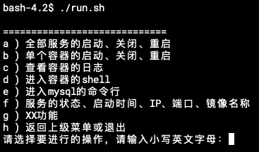

## Jellyfin Docker-Compose版本

Jellyfin是一个开源的媒体管理和播放系统，Emby和Plex的免费替代品。

### 三步运行起来

1. 拉取项目代码：

    ```
    git clone https://github.com/philiphuang/jellyfin.git
    ```

2. 运行run.sh

    ```
    cd jellyfin
    ./run.sh
    ```

    

    进入交互菜单，选择 ```a``` -> ```b``` ，启动所有服务。（第一次运行会经历漫长的拉取镜像过程，请耐心等候。）

3. 打开浏览器访问宿主机，例如：[http://localhost:8096/](http://localhost:8096/)


### 补充说明
1. 使用DC-Starter管理，详细使用说明:[https://github.com/philiphuang/docker-compose-starter](https://github.com/philiphuang/docker-compose-starter)
2. 镜像来自：https://hub.docker.com/r/linuxserver/jellyfin
3. 文档:https://docs.linuxserver.io/images/docker-jellyfin
